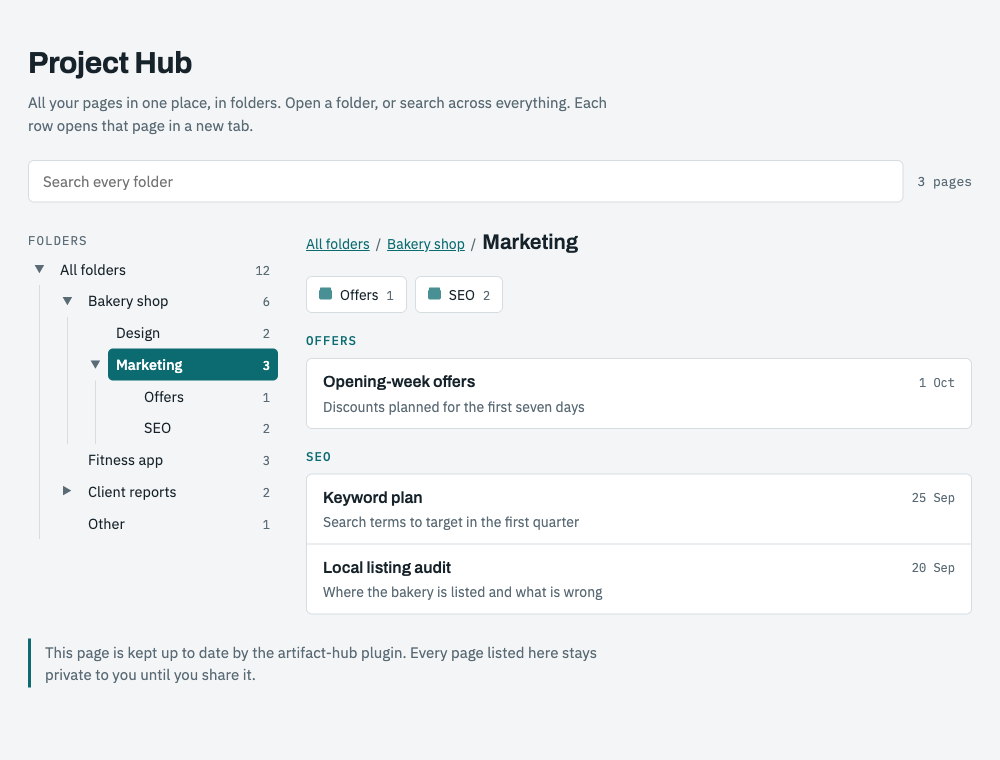
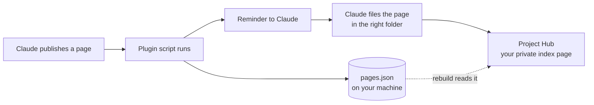

<div align="center">

# Artifact Hub

**Folders for your Claude artifacts.**

Every page you publish from Claude Code is saved to a list on your machine and filed into project folders and subfolders on one index page.

[](https://github.com/SureshKumar-24/artifact-hub/actions/workflows/test.yml)
[](https://github.com/SureshKumar-24/artifact-hub/tags)
[](LICENSE)




<sub>The screenshot shows example pages.</sub>

</div>

## Contents

- [Install](#install)
- [The problem](#the-problem)
- [What you get](#what-you-get)
- [How it works](#how-it-works)
- [Using it](#using-it)
- [Folders and subfolders](#folders-and-subfolders)
- [What it runs, reads and sends](#what-it-runs-reads-and-sends)
- [What it costs](#what-it-costs)
- [Limits](#limits)
- [Questions](#questions)
- [Troubleshooting](#troubleshooting)
- [Uninstall](#uninstall)
- [Contributing](#contributing)

## Install

In Claude Code:

```
/plugin marketplace add SureshKumar-24/artifact-hub
/plugin install artifact-hub@artifact-hub
```

Then run this once:

```
/artifact-hub:setup
```

| You want to | Do this |
|---|---|
| Install a fixed, reviewed version | Add `@v1.3.0` to the first command |
| Try it without installing | `claude --plugin-dir path/to/artifact-hub` |
| Read the code first | It is one script, two instruction files and a page template |

**Needs:** Claude Code on a plan that can publish artifacts, and Node.js on your PATH.

## The problem

Claude's artifact gallery is one flat list of recent pages.

- Older pages drop out of view. If you no longer have the link, the page is hard to get back.
- Nothing separates one project from another. A client report sits next to a study plan.
- There are no folders.

## What you get

| | |
|---|---|
| **Every link is kept** | The moment a page is published, its link, title and project folder are written to a plain file on your machine. The plugin does this itself, so it does not depend on Claude remembering. |
| **Folders and subfolders** | One index page, your Project Hub, shows a folder tree: a folder per project, subfolders to any depth, a count on each, breadcrumbs. |
| **Search** | One box searches every folder at once. |
| **Nothing extra to do** | Publish as usual. The page is filed under the project of the repository you are working in. |
| **Deleted pages are cleaned up** | Delete an artifact and its row leaves the hub. |
| **Find by asking** | "Where is my pricing page?" gets you the link. |
| **Private** | The hub is a private artifact in your own Claude account. Nothing leaves your machine except through Claude's own publish. |

## How it works



There are two layers, on purpose:

1. **The script** saves the link to `~/.claude/artifact-hub/pages.json`. This always happens.
2. **Claude** adds the page to your hub after a short reminder. If that step is ever missed (a session cut short), the link is still saved, and `/artifact-hub:hub` puts it on the hub.

## Using it

| When | What you do | What happens |
|---|---|---|
| Once | `/artifact-hub:setup` | Claude reads your gallery, proposes projects and folders, and publishes your hub when you agree. |
| Every publish | Nothing | The link is saved and the page is filed on your hub. |
| You delete a page | Nothing | Its row is taken off the hub. |
| You cannot find a page | Ask: "where is my pricing page?" | Claude answers with the title, folder and link. |
| You want to reorganise | Ask: "move the SEO pages into Shop / Marketing" | Claude moves them and remembers the rule. |
| Any time | `/artifact-hub:hub` | Rebuilds the hub from the gallery and the saved list. Adds what is new, never removes what is there. |

## Folders and subfolders

A project is a top-level folder. Inside it you can have folders within folders:

```
All folders
├── Bakery shop
│   ├── Design
│   └── Marketing
│       ├── Offers
│       └── SEO
├── Fitness app
└── Client reports
    └── 2026
```

You manage them by asking Claude in plain words:

| Say | Result |
|---|---|
| "make a folder Reports inside Shop" | A new subfolder |
| "move the SEO pages into Shop / Marketing" | Pages moved, rule saved for new pages |
| "rename Marketing to Growth" | Folder renamed, pages kept |
| "remove the Offers folder" | Its pages move up to the parent folder |
| "this folder belongs to the Shop project" | Pages published from that repository go to Shop from now on |

How a new page finds its place:

1. **The repository you are working in**, if you have linked it to a project.
2. **Words in the page title**, matched against each project's and subfolder's rules.
3. Otherwise **Other**, and Claude tells you so you can correct it once.

No row is ever deleted by a move, a rename or a rebuild.

## What it runs, reads and sends

A plugin can run code on your machine, so here is all of it.

| | |
|---|---|
| **Runs** | One hook, on the `PostToolUse` event for the `Artifact` tool. It starts `hooks/on-artifact.js` (121 lines, plain Node.js, no dependencies) directly, with no shell in between. Nothing runs at session start. |
| **Reads** | The result of the Artifact tool call, the `<title>` of the file just published, and your hub settings. During setup or a rebuild, Claude reads the list of your own artifacts through its own Artifact tool. |
| **Writes** | Two files in `~/.claude/artifact-hub/`: `pages.json` (your published links) and `hub.json` (your hub's address and folder rules). And your hub artifact. |
| **Sends** | Nothing. No network request, no server, no analytics, no account. |

Check it yourself in a minute: [SECURITY.md](SECURITY.md). The script's behaviour is covered by tests that run on Linux, macOS and Windows for every change.

## What it costs

- Nothing at session start: no extra context, no startup step.
- One reminder of about 80 words, only in a turn where Claude publishes or deletes an artifact.
- Filing a page is one read and one republish of the hub.

## Limits

- **Claude Code only.** Pages made in the claude.ai chat app are picked up when you run `/artifact-hub:hub`.
- **Pages from before you installed** come from the gallery listing, which shows the 50 most recently updated. Older ones have to be added by name once.
- **The folders live on your hub page.** They do not change Claude's own gallery.
- **Filing is done by Claude** after a reminder. The saved list is the safety net; a rebuild catches up.
- **Two sessions publishing at the same instant** could miss one saved link. A rebuild picks it up from the gallery.
- If Claude adds folders to the gallery itself, you will no longer need this.

## Questions

<details>
<summary><b>Can other people see my hub?</b></summary>

No. It is private to you, like any artifact, unless you share it yourself. Each page it links to keeps its own sharing setting.
</details>

<details>
<summary><b>Will a rebuild delete rows?</b></summary>

No. A page missing from the gallery listing is treated as old, not deleted. A row is removed only when you delete the artifact or say the page is gone.
</details>

<details>
<summary><b>Does it work for a team?</b></summary>

Each person has their own hub. You can share your hub page like any artifact, but the pages it links to must be shared too for others to open them.
</details>

<details>
<summary><b>Can I edit the saved list by hand?</b></summary>

Yes. `~/.claude/artifact-hub/pages.json` is plain JSON: one entry per page with `url`, `title`, `folder`, `first`, `last`.
</details>

<details>
<summary><b>What if I do not want a hub, only the saved list?</b></summary>

Install and skip setup. Every published link is still saved. You will see one mention of setup per day at most, and only in a turn where you publish.
</details>

<details>
<summary><b>Is this made by Anthropic?</b></summary>

No. It is an independent open-source plugin.
</details>

## Troubleshooting

| Symptom | Try |
|---|---|
| A page is not on the hub | `/artifact-hub:hub` |
| A page went to the wrong folder | Tell Claude where it belongs; the rule is saved |
| Nothing happens after a publish | Check `node --version` works in your terminal, and that the plugin is enabled in `/plugin` |
| The hub still has the old flat layout | Run `/artifact-hub:hub` once; it upgrades the layout and keeps every row |
| A second hub appeared | Tell Claude which one to keep; the other can be deleted from the gallery |

Anything else: [open an issue](https://github.com/SureshKumar-24/artifact-hub/issues).

## Uninstall

`/plugin uninstall artifact-hub`, then delete `~/.claude/artifact-hub/` if you no longer want the saved list. Your hub artifact stays until you delete it yourself.

## Contributing

Issues and pull requests are welcome. The whole plugin is small:

```
.claude-plugin/   plugin and marketplace manifests
hooks/            hooks.json and on-artifact.js (the only code that runs)
skills/hub/       rebuild, filing, folders; template.html is the hub page
skills/setup/     first-time setup
test/             node --test test/
```

Changes are listed in [CHANGELOG.md](CHANGELOG.md).

## Licence

MIT, by Suresh Kumar. Not made by or affiliated with Anthropic.
